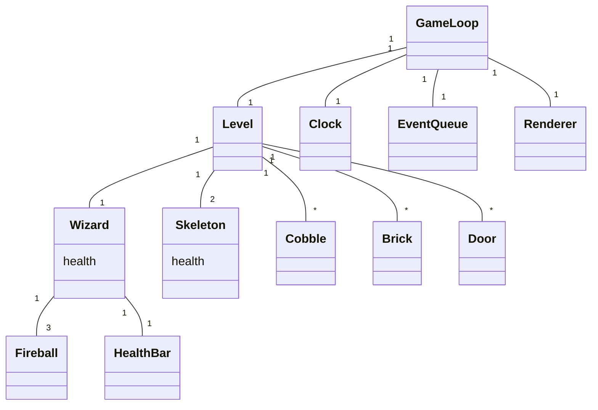

```mermaid
 classDiagram
    GameLoop "1" -- "1" Level
    GameLoop "1" -- "1" Clock
    GameLoop "1" -- "1" EventQueue
    GameLoop "1" -- "1" Renderer
    Level "1" -- "1" Wizard
    class Wizard {
        health
    }
    Level "1" -- "2" Skeleton
    class Skeleton {
        health
    }
    Wizard "1" -- "3" Fireball
    Wizard "1" -- "1" HealthBar
    Level "1" -- "*" Cobble
    Level "1" -- "*" Brick
    Level "1" -- "*" Door
```
