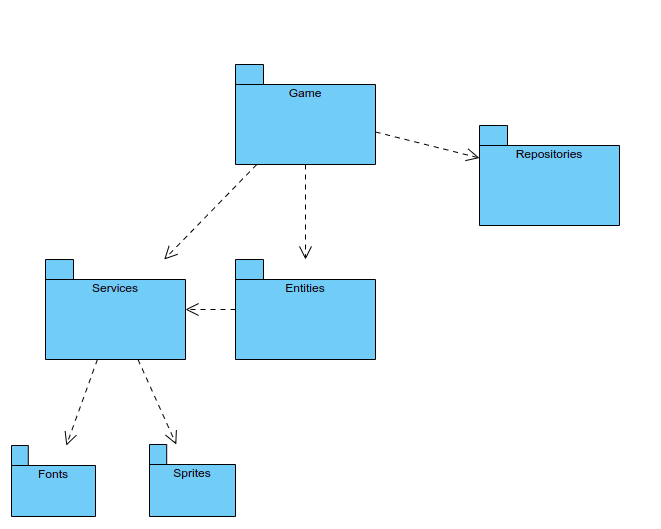
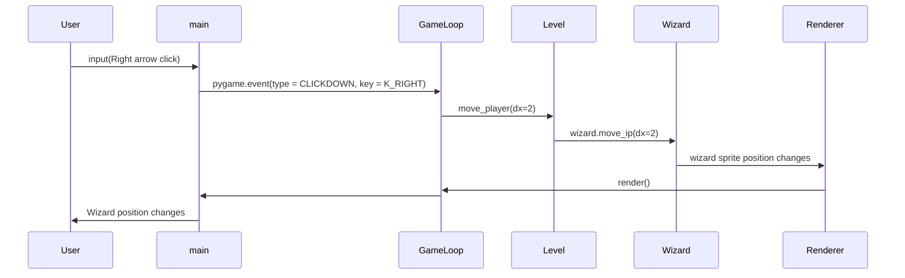

# Arkkitehtuurikuvaus

## Rakenne

Kansion *game* sisällä oleva koodi huolehtii itse pelistä ja sen 
käyttöliittymästä, kansio *entities* sisältää luokkia joita peli käytättää, kuten
spritet, *services* sisältäää yleisiä tarpeellisia funktioita ja *repositories*
huolehtii tietokannasta.

## Käyttöliittymä
Pelissä on neljä erilaista näkymää:
- Aloitusnäyttö, jossa voi asettaa käyttäjänimen sekä jossa ohjeet kontrolleihin
- Itse peli
- Game Over-näyttö, jos pelaaja kuolee, se näyttää pelaajan nimen sekä scoreboardin
- Game Completed-näyttö, jos pelaaja tappaa loppubossin, se näyttää pelaajan nimen sekä scoreboardin

## Sovelluslogiikka
Seuraavassa luokkakaaviossa esitellään pelin luokkien riippuvuudet

```mermaid
 classDiagram
    GameLoop "1" -- "1" Levels
    Levels "1" -- "5" Level
    GameLoop "1" -- "1" Clock
    GameLoop "1" -- "1" EventQueue
    GameLoop "1" -- "1" Renderer
    Renderer "1" -- "1" TextBox
    Level "1" -- "1" Wizard
    class Wizard {
        health
    }
    Level "1" -- "1" Enemies
    Enemies "1" -- "*" Skeleton
    class Skeleton {
        health
    }
    Enemies "1" -- "1" Dragon
    Class Dragon {
        health
    }
    Enemies "1" -- "3" Firecloud
    Wizard "1" -- "3" Fireball
    Wizard "1" -- "1" HealthBar
    Level "1" -- "*" Cobble
    Level "1" -- "*" Brick
    Level "1" -- "1" Doors
    Doors "1" -- "*" Door
    Doors "1" -- "*" Gate
```

## Tietojen tallennus
Pelaajanimet sekä pelin läpäisyajat tallennetaan paikalliseen SQLite-tietokantaan.
Tietojen tallettamisesta tietokantaan huolehtii `ResultRepository`-luokka.

Testitapauksissa käytetään erillistä testitietokantaa, jotta oikea tietokanta ei sotkeudu.

### Tiedostojen nimet
Tietokannan nimen voi vapaasti konfiguroida `.env`-tiedostossa. Testitietokannan nimeä
voi konfiguroida `.env.test`-tiedostossa

## Toiminnallisuudet

### Velhon liikuttaminen - sekvenssikaavio

