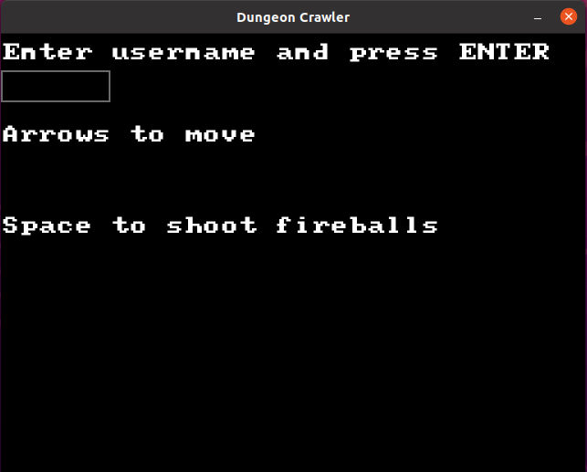
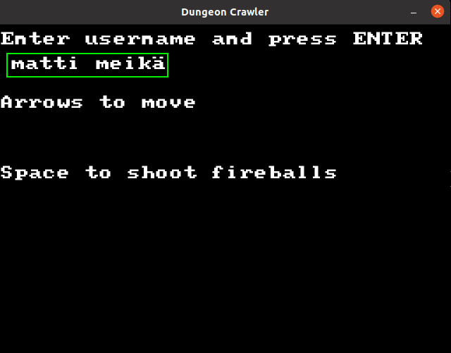
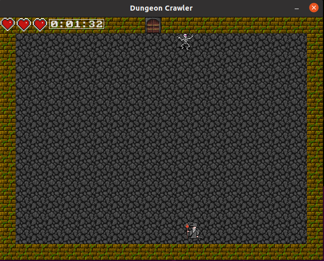
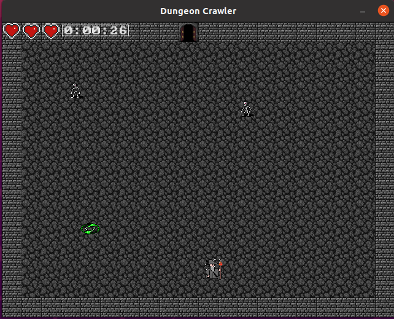
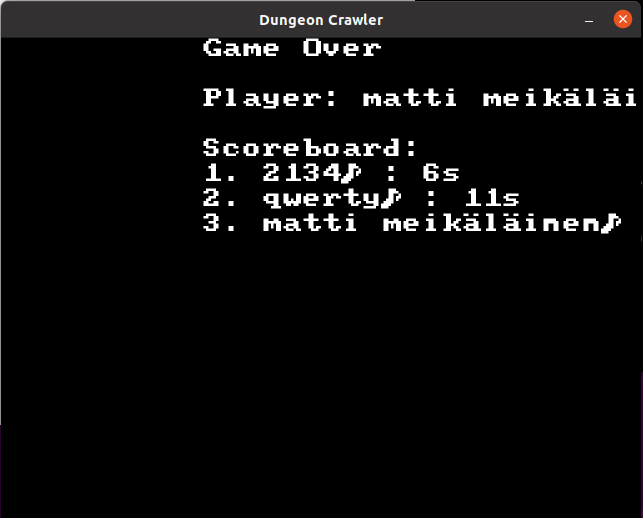
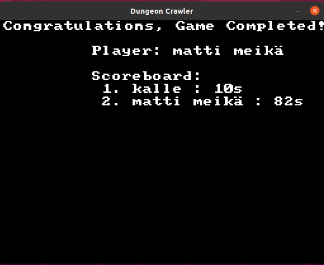

# Käyttöohje

## Konfigurointi
Tietokannan nimen voi määrittää käynnistyshakemistossa *.env*-tiedostossa.
Tietokanta luodaan automaattisesti *src*-hakemistoon, jos sitä ei ole vielä olemassa.
Tiedoston muoto on seuraavanlainen:
```
DATABASE_FILENAME=database.db
```
Testitietokannan nimen voi konfiguroida samalla tavalla, mutta *.env.test*-tiedostossa.

## Ohjelman käynnistäminen
Asenna riippuvuudet komennolla:
```
poetry install
```

Alusta tietokanta komennolla:
```
poetry run invoke build
```

Käynnistä ohjelma komennolla:
```
poetry run invoke start
```

## Pelin pelaaminen
Peli avautuu päävalikkoon:



Syötä pelaajatunnuksesi klikkaamalla laatikkoa, kirjoittamalla se ja painamalla ENTER:



Liikuta velhoa nuolinäppäimillä ja ammu tulipalloja välilyönnillä:



Avaa tason ovi painamalla portaalia:



Jos kuolet näet 10 nopeinta pelin läpäissyttä:



Jos voitat loppubossin, näet nimesi ja 10 nopeinta pelin läpäissyttä:


