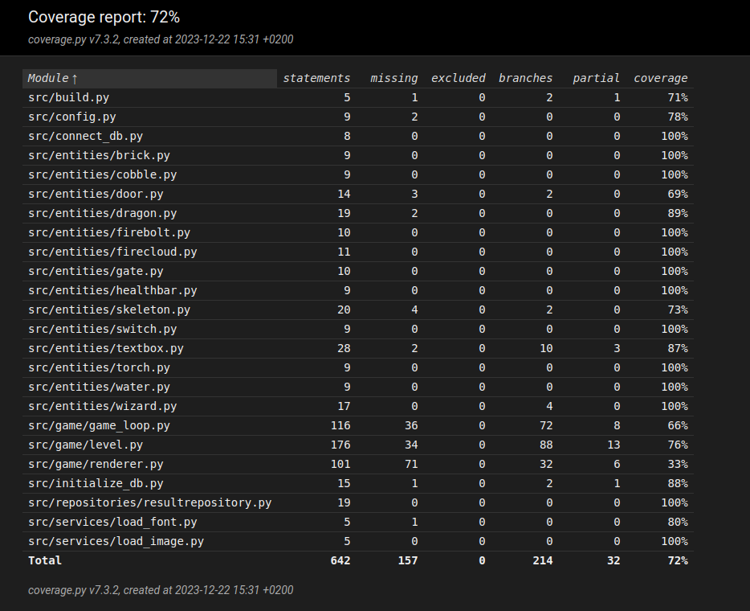

# Testausdokumentti

Ohjelmaa on testattu automatisoiduin yksikkö-, sekä integraatiotestein
unittestillä, sekä manuaalisesti käyttöliittymässä.

## Yksikkö- ja integraatiotestaus

### Peli
Pelin pyörimistestä vastaavia luokkia `GameLoop`, `Renderer` sekä `Level` testattiin
vastaavasti luokilla [TestGameLoop-](https://github.com/emilkivela/ot-harjoitustyo/blob/main/src/tests/game_loop_test.py), [TestRenderer-](https://github.com/emilkivela/ot-harjoitustyo/blob/main/src/tests/renderer_test.py), sekä [TestLevel](https://github.com/emilkivela/ot-harjoitustyo/blob/main/src/tests/level_test.py)-
luokilla

### Repositorio-luokat
Repositorioluokkaa `ResultRepository` testataan [TestResultRepositoy](https://github.com/emilkivela/ot-harjoitustyo/blob/main/src/tests/resultrepository_test.py)-
luokalla. Testeissä käytetään erillistä testitietokantaa. Testitietokannan nimi
on konfigoruitu .env.test -tiedostossa.

### Testauskattavavuus
Sovelluksen haaraumakattavuus on 72%.

Testeistä jäi testaamatta pääasiassa sellaisia asioita joita on vaikea testata
pygamessa, kuten mitä se renderi ruudulle, sekä sekalaisia haaraumavaihtoehtoja 
sielä täältä.

### Järjestelmätestaus, asennus ja toiminnallisuudet
Kaikkia näitä on testattu manuaalisesti.

