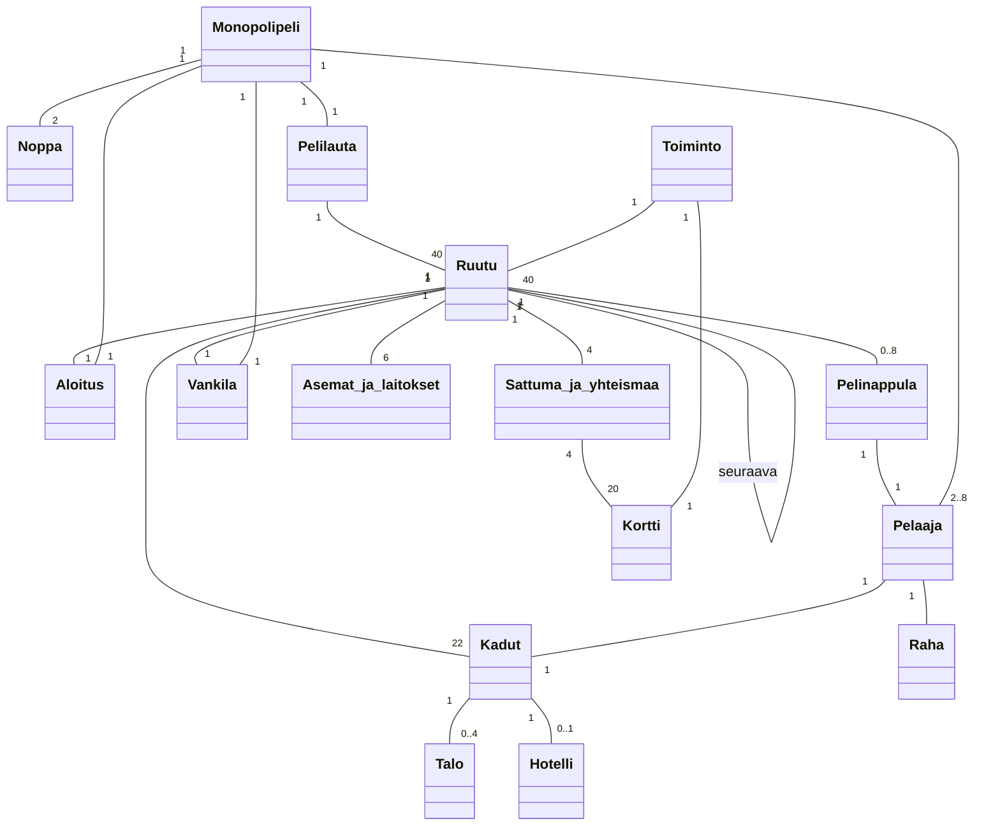

## Monopoli, alustava luokkakaavio

```mermaid
  classDiagram
    Monopolipeli "1" -- "2" Noppa
    Monopolipeli "1" -- "1" Pelilauta
    Pelilauta "1" -- "40" Ruutu
    Ruutu "1" -- "1" Ruutu : seuraava
    Ruutu "1" -- "1" Aloitus
    Ruutu "1" -- "4" Sattuma_ja_yhteismaa
    Ruutu "1" -- "1" Vankila
    Ruutu "1" -- "6" Asemat_ja_laitokset
    Ruutu "1" -- "22" Kadut
    Ruutu "1" -- "0..8" Pelinappula
    Pelinappula "1" -- "1" Pelaaja
    Pelaaja "2..8" -- "1" Monopolipeli
    Monopolipeli "1" -- "1" Aloitus
    Monopolipeli "1" -- "1" Vankila
    Toiminto "1" -- "40" Ruutu
    Sattuma_ja_yhteismaa "4" -- "20" Kortti
    Toiminto "1" -- "1" Kortti
    Kadut "1" -- "0..4" Talo
    Kadut "1" -- "0..1" Hotelli
    Pelaaja "1" -- "1" Kadut
    Pelaaja "1" -- Raha
  
```
